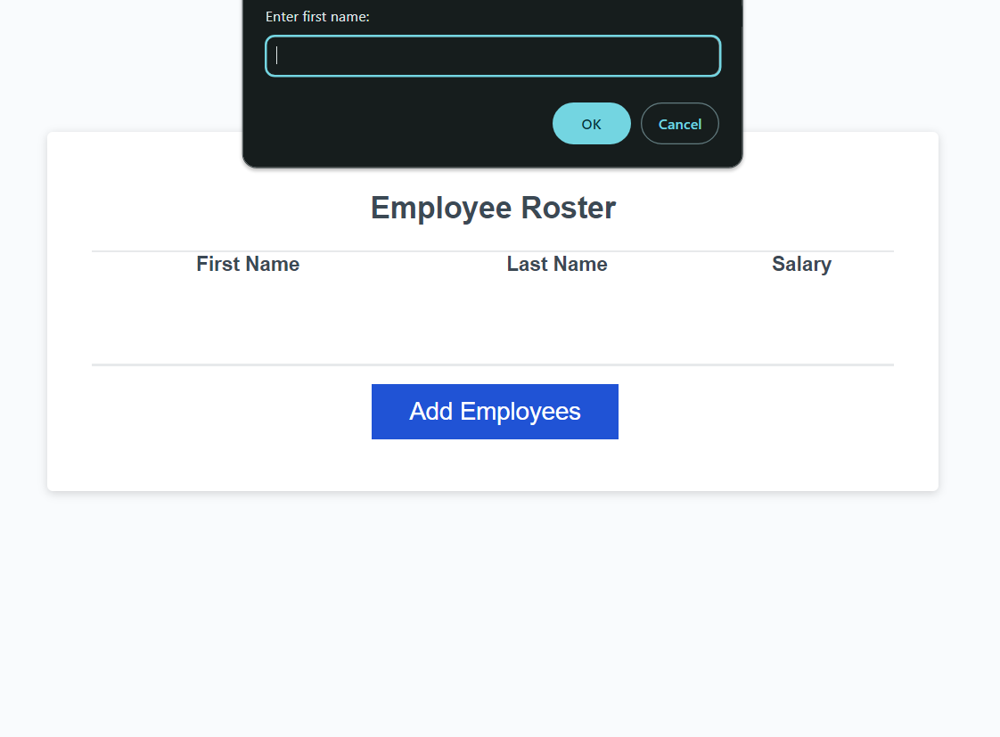

# Employee-Payroll-Tracker

## Description
In this app, a payroll manager is able to view and manage their employees' payroll data. This app enables a user to enter employee information, such as the first name, last name, and salary, and then view the information alphabetically on a chart. In the console, the application calculates and displays the average salary of all of the employees entered and selects a random employee from the entered data, labeling them a winner for some undisclosed prize.

The purpose of this project was for me to get better acquainted with some of the basics of Javascript. Through this refactor activity, I worked heavily with console logging and creating loops. I had to validate input, update the DOM based on data input, and prompting users based on certain criteria. I reinforced my knowledge of methods, arrays, and strings.

## Usage

In order to access the deployed website, click the following link: [https://nearias3.github.io/Employee-Payroll-Tracker/]

## Credits

Useful information about coding, including tutorials and guides, were provided by the UT Bootcamp GitLab: [https://git.bootcampcontent.com/University-of-Texas-at-Austin/UTA-VIRT-FSF-PT-05-2024-U-LOLC/].

I frequently referred to Mozilla's developer tool blogs (MDN Web Docs) for help identifying the correct code and syntax: [https://developer.mozilla.org/en].

## License

Please refer to the license in the repo.